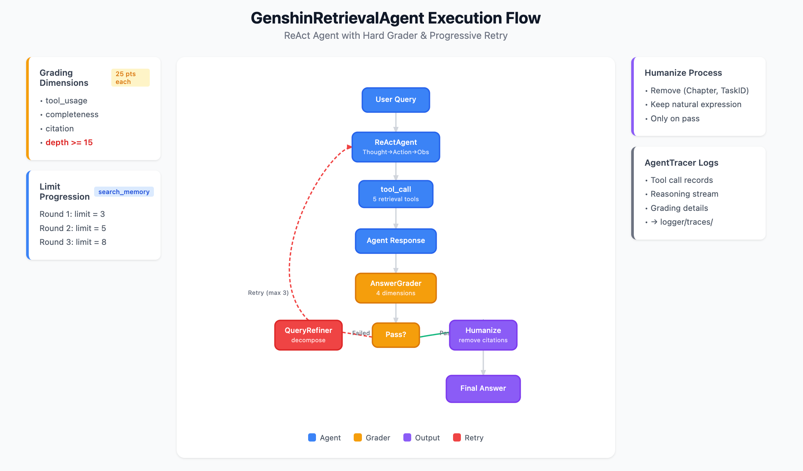
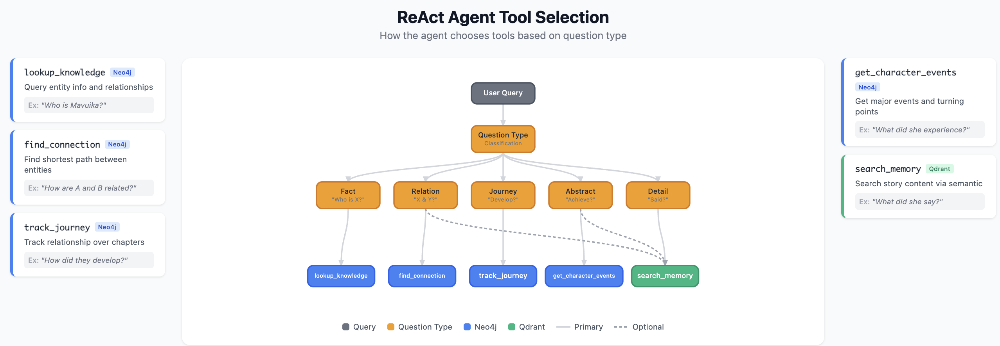
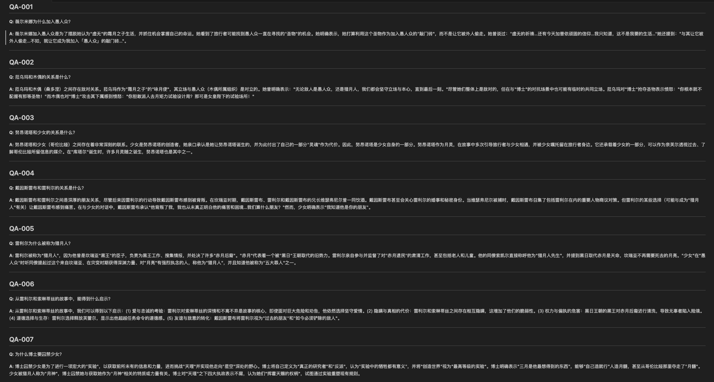
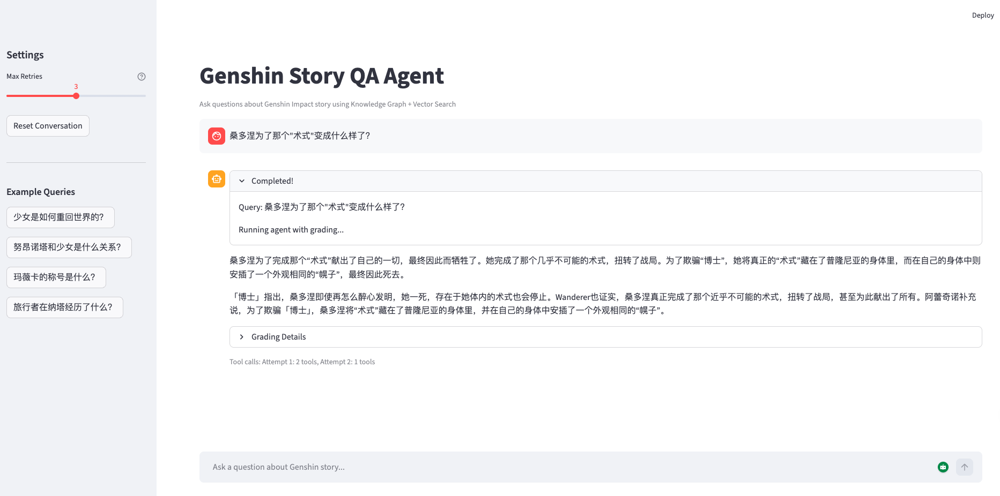

A knowledge-grounded QA agent for Genshin Impact storyline (Natlan · Nodkaleye), combining Knowledge Graph traversal with semantic search to answer complex narrative questions that general LLMs cannot handle.

<!--more-->
## Live Demo



## Agent Architecture

The system uses a **ReAct Agent** with a Hard Grader feedback loop:

1. **ReActAgent**: LlamaIndex-based reasoning engine executing Thought→Action→Observation cycles
2. **Tool Call**: Dispatches to 5 retrieval tools based on question type
3. **AnswerGrader**: Evaluates response quality across 4 dimensions (25 pts each)
4. **QueryRefiner**: Decomposes failed queries into targeted sub-queries
5. **Humanize**: Removes academic citations for natural output

Key mechanism: **Progressive Retry** with limit expansion (3→5→8) ensures comprehensive search coverage.

## Tool Selection

Five specialized retrieval tools target different question types:

| Tool | Source | Purpose |
|------|--------|---------|
| `lookup_knowledge` | Neo4j | Entity attributes and direct relations |
| `find_connection` | Neo4j | Shortest path between entities |
| `track_journey` | Neo4j | Relationship evolution over time |
| `get_character_events` | Neo4j | Major events and turning points |
| `search_memory` | Qdrant | Semantic search on story text |

## Sample QA Results

The agent achieves **96.9% average score** on complex narrative questions:

- **Fact queries**: "Why did Vermilina join the Fatui?" → Extracts motivation with direct quotes
- **Relation queries**: "What is the relationship between La'uma and Sandrone?" → Traces enemy status with context
- **Journey queries**: "Why is Rerir called the Moon Hunter?" → Reconstructs historical events across chapters

## Demo Interface

Features:
- Natural language chat interface
- Real-time tool call visualization
- Grading feedback display
- Multi-turn conversation support

## Tech Stack

- **Agent Framework**: LlamaIndex ReActAgent
- **Knowledge Graph**: Neo4j (entities, relations, events)
- **Vector Database**: Qdrant (story text embeddings)
- **LLM**: Google Gemini 2.5 Flash
- **Frontend**: Streamlit
- **Embedding**: text-embedding-004

## Key Features

- **Hard Grader**: Enforces depth threshold (≥15) to ensure evidence-backed answers
- **Self-Correcting RAG**: Failed answers trigger query refinement and retry
- **Hybrid Retrieval**: Combines graph traversal with semantic search
- **Context Injection**: Previous attempt history guides subsequent searches
- **Full Tracing**: Complete execution logs saved to `logger/traces/`
