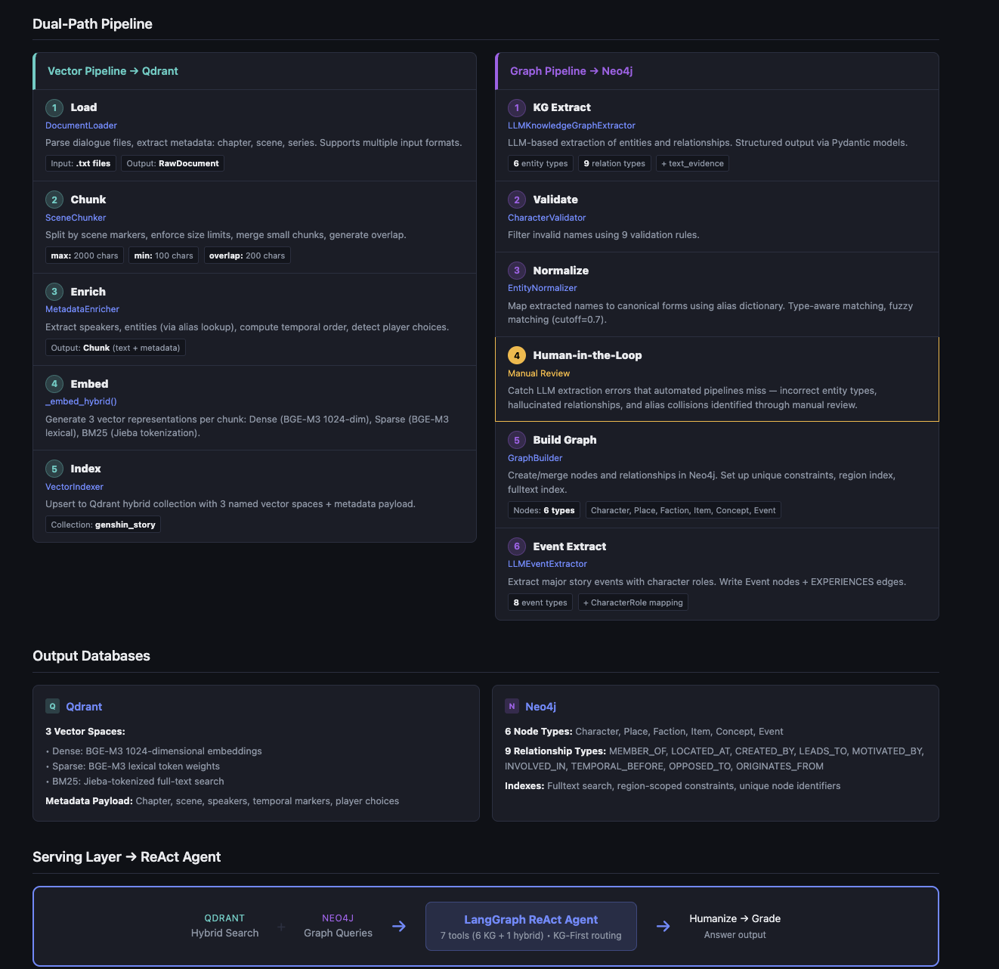
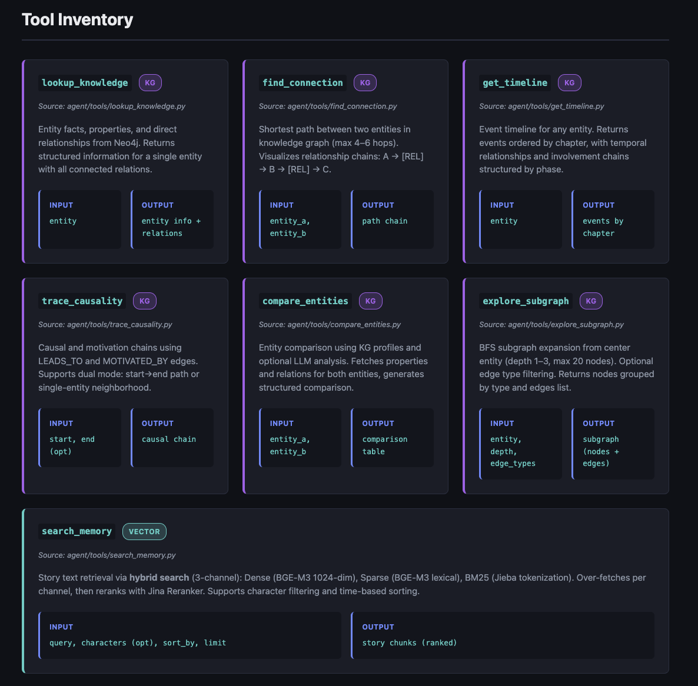
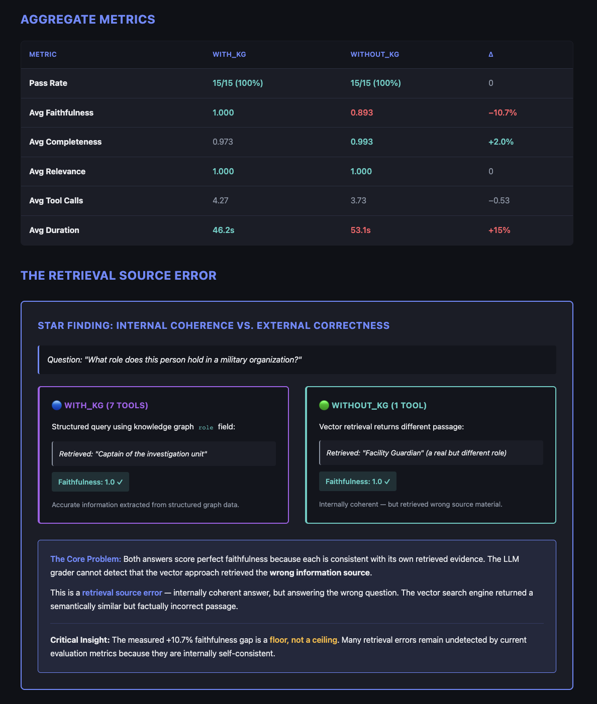
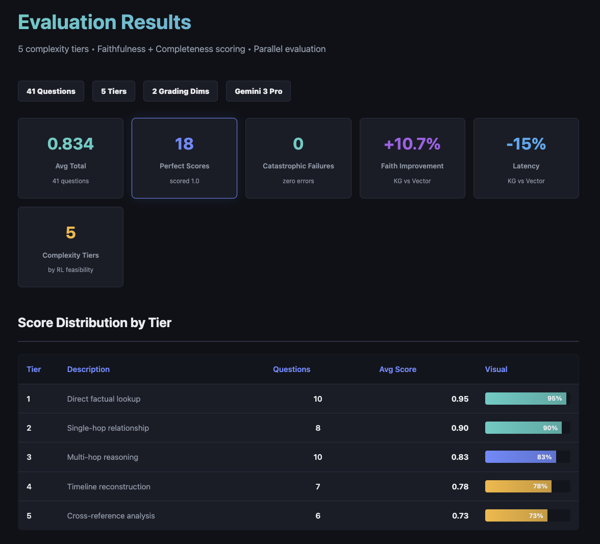

An end-to-end retrieval-augmented QA system that combines knowledge graph traversal with tri-signal hybrid vector search, built on a LangGraph ReAct agent with 7 retrieval tools. Ablation experiments revealed a class of LLM hallucination — **retrieval source errors** — that automated evaluators score as perfect, demonstrating that structured knowledge eliminates failure modes vector search alone cannot address.

<!--more-->

## The Problem

General-purpose LLMs hallucinate on domain-specific factual questions — entity attributes, organizational affiliations, temporal event sequences. Standard RAG pipelines mitigate this with vector retrieval, but when the retrieved passage is *plausible yet wrong*, both the answer and the automated evaluation look correct. This failure mode is invisible to conventional metrics.

## Architecture

<!-- TODO: Insert architecture diagram — dual-path pipeline (vector + KG) feeding into LangGraph ReAct agent -->

I designed a **dual-path data pipeline** that ingests raw dialogue text into two complementary stores:

- **Knowledge Graph** (Neo4j): 6 entity types, 9 relationship types, with multi-level data quality control — LLM extraction → Pydantic schema validation → CharacterValidator (9 rules) → EntityNormalizer (alias resolution with fuzzy matching)
- **Hybrid Vector Store** (Qdrant): Tri-signal retrieval combining dense embeddings (BAAI/bge-m3, 1024-dim), sparse lexical vectors, and BM25 (Jieba tokenization), fused through a cross-encoder reranker

A **Human-in-the-Loop validation** step catches LLM extraction errors that automated pipelines miss — incorrect entity types, hallucinated relationships, and alias collisions identified through manual review of extraction outputs.

On top of this, I built a **LangGraph ReAct agent with 7 retrieval tools** — 6 for structured graph queries, 1 for hybrid search — orchestrated as a `StateGraph` with a KG-First routing strategy: when a question targets specific entities, graph tools fire before vector search.

The workflow follows: `ReAct Loop → Humanize → Post-hoc Grade`, with tool call limits (5 per iteration, 20 total) and a force-answer fallback to guarantee termination.

## Tool Selection

<!-- TODO: Insert tool selection flow diagram — 7 tools (6 KG + 1 hybrid) with KG-First routing -->

Seven specialized retrieval tools target different question types:

| Tool | Source | Purpose |
|------|--------|---------|
| `lookup_knowledge` | Neo4j | Entity attributes and direct relations |
| `find_connection` | Neo4j | Shortest path between entities |
| `get_timeline` | Neo4j | Event timeline for any entity, ordered by chapter |
| `trace_causality` | Neo4j | Causal/motivation chains (LEADS_TO, MOTIVATED_BY) |
| `compare_entities` | Neo4j | Side-by-side entity comparison with property alignment |
| `explore_subgraph` | Neo4j | BFS neighborhood expansion from center entity |
| `search_memory` | Qdrant | Tri-signal hybrid search on narrative text |

## Key Finding: Retrieval Source Errors

<!-- TODO: Insert ablation comparison chart — KG+Vector vs Vector-Only, showing faithfulness gap and retrieval source error example -->

To measure the knowledge graph's contribution, I ran a controlled ablation study: the full 7-tool agent versus a vector-only baseline across 15 questions at 5 complexity tiers.

The critical finding: on a question about an entity's organizational role, the graph agent queries a structured `role` field and returns the correct answer. The vector-only agent retrieves a *different* passage containing a *different real role* the entity holds — factually valid text, but answering the wrong question entirely. Both receive **perfect faithfulness scores from the LLM grader**, because each answer is internally consistent with its own retrieved evidence.

I call this a **retrieval source error**: the vector approach retrieved the wrong information, but the answer built on it is internally coherent. The automated evaluator cannot distinguish correct retrieval from plausible-but-wrong retrieval.

This means the measured **+10.7% faithfulness gap** (1.000 vs 0.893) is a **floor, not a ceiling** — the real advantage of structured knowledge is larger than automated evaluation can measure.

## Evaluation Results

<!-- TODO: Insert evaluation results dashboard — score distribution across 5 tiers, faithfulness vs completeness -->

Evaluation framework: 41 questions stratified into **5 complexity tiers** based on RL feasibility, with two-dimensional scoring system measuring faithfulness and completeness.

| Metric | Result |
|--------|--------|
| Average Total Score | **0.834** |
| Perfect Scores (1.0) | **18 / 41** |
| Catastrophic Failures | **0** |
| Tier 1 (factual) | 0.95 |
| Tier 5 (cross-reference) | 0.73 |

Performance degrades gracefully across complexity tiers — no catastrophic failures even on the hardest questions.

## Tech Stack

- **Agent Framework**: LangGraph StateGraph (ReAct pattern)
- **Knowledge Graph**: Neo4j 5 Community + APOC (6 entity types, 9 relation types)
- **Vector Database**: Qdrant (tri-signal hybrid: dense + sparse + BM25)
- **LLM**: Google Gemini 3 Pro (reasoning with thinking enabled)
- **Embedding**: BAAI/bge-m3 (dense 1024-dim + sparse lexical)
- **Data Quality**: Pydantic models, CharacterValidator, EntityNormalizer, Human-in-the-Loop validation
- **Evaluation**: Custom 2-dimensional grading (Faithfulness + Completeness)
