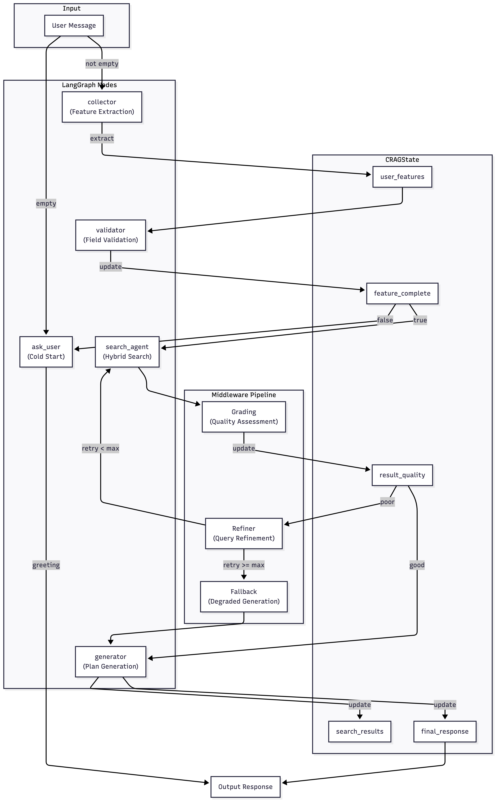
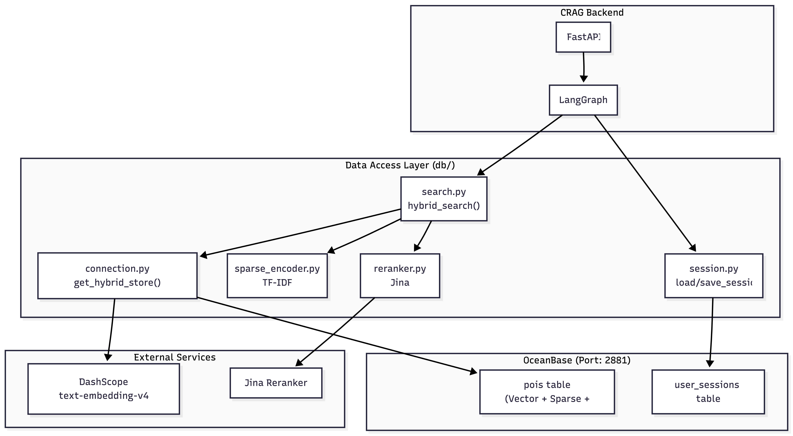
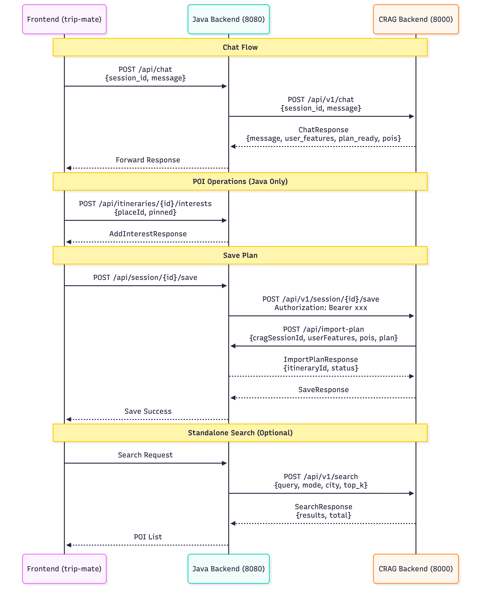
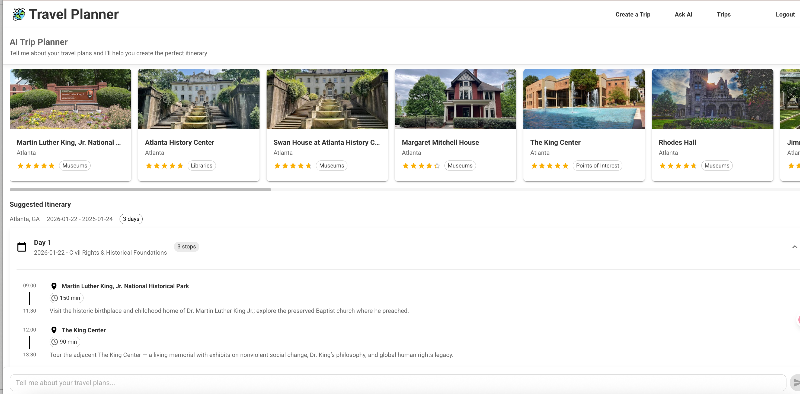

An intelligent travel planning assistant powered by Corrective Retrieval Augmented Generation (CRAG) and OceanBase's hybrid search capabilities, delivering highly relevant travel recommendations through natural conversation.

<!--more-->

## System Architecture

The system is built on **LangGraph**, orchestrating a sophisticated state machine that mimics a human travel agent:

1. **Collector**: Extracts user preferences (budget, interests, travel style) from natural language input
2. **Validator**: Checks if sufficient information is collected; loops back to ask clarifying questions if needed
3. **Search Agent**: Executes hybrid search against OceanBase when requirements are complete
4. **Grader**: Assesses result quality after reranking and filtering
5. **Refiner**: Rewrites queries and retries search if data quality is poor
6. **Generator**: Produces personalized day-by-day itineraries optimized for location proximity and opening hours

## Hybrid Search Pipeline

Our triple-layer hybrid search pipeline ensures high-precision results:

- **Vector Search**: Semantic similarity search using DashScope text-embedding-v4 to capture meaning beyond keywords
- **Sparse Search**: TF-IDF based keyword matching for exact term matches
- **Fulltext Search**: OceanBase full-text index for comprehensive text coverage

Results are merged using **Reciprocal Rank Fusion (RRF)**, then refined with **Jina Reranker v3** for optimal ranking.

## API Integration

The system consists of two integrated pipelines:

**RAG Pipeline** - Supports conversational AI flow through LangGraph nodes for feature extraction, validation, search, and generation.

**API Integration Pipeline** - Connects three service layers:
- React frontend for user interaction
- Java backend (Spring Boot) for business logic and JWT authentication
- CRAG backend (FastAPI) for AI-powered search and generation

## Live Demo

The application features:
- Natural language chat interface for trip planning
- AI-generated POI recommendations with ratings and categories
- Interactive itinerary builder with drag-and-drop reordering
- Day-by-day schedule optimization based on location and opening hours

## Tech Stack

- **CRAG Backend**: Python, FastAPI, LangGraph
- **Java Backend**: Spring Boot, Spring Security, JWT
- **Frontend**: React
- **Database**: OceanBase (Vector + Sparse + Fulltext search)
- **AI Models**:
  - Main LLM: qwen-plus-latest
  - Fallback LLM: gemini-3-pro-preview
  - Embedding: text-embedding-v4 (DashScope)
  - Reranker: jina-reranker-v3

## Key Features

- **Self-Correcting RAG**: Unlike standard RAG, CRAG evaluates retrieval quality and triggers refinement when needed
- **Hybrid Search**: Combines semantic, keyword, and fulltext search for comprehensive coverage
- **Conversational Planning**: Natural language interface with intelligent clarifying questions
- **Personalized Recommendations**: Considers user preferences, budget, and travel style
- **Itinerary Optimization**: Greedy algorithm optimizes routes considering time and location constraints
