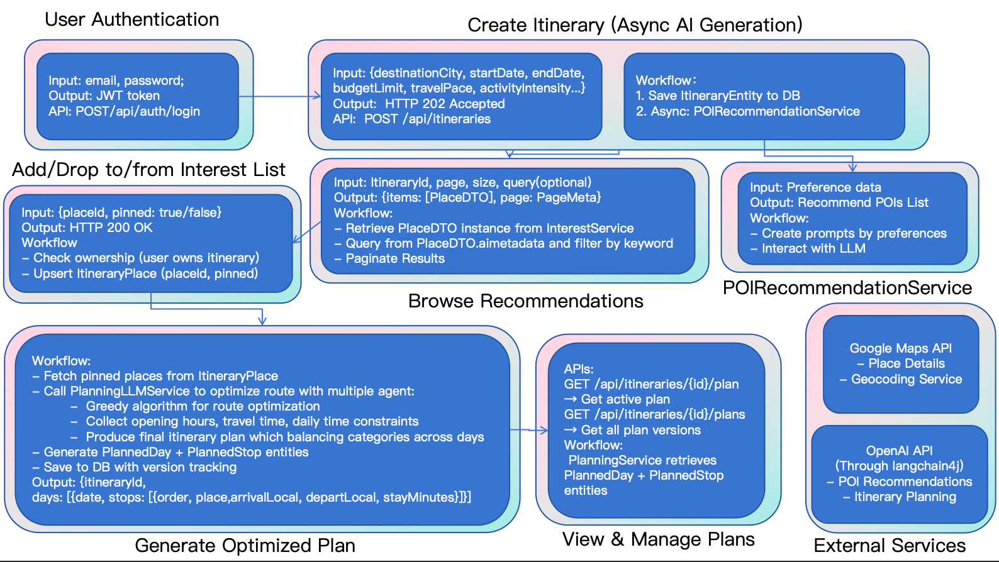

A full-stack travel planning application with AI-powered itinerary generation, featuring JWT-based authentication and preference-driven recommendations.

<!--more-->

## System Architecture

The workflow diagram illustrates the core user journey:

1. **Create Itinerary**: User submits trip parameters (destination, dates, budget, travel pace). The system saves the itinerary and asynchronously triggers `POIRecommendationService` to generate personalized POI suggestions via LangChain4j + OpenAI.

2. **Browse & Curate**: User browses AI-generated recommendations with pagination and keyword filtering, then adds preferred POIs to their interest list.

3. **Generate Optimized Plan**: `PlanningLLMService` uses a greedy algorithm to optimize routes considering opening hours, travel time, and daily constraints—producing a balanced multi-day itinerary with `PlannedDay` and `PlannedStop` entities.

4. **View & Manage**: RESTful APIs expose plan versions, enabling users to retrieve and compare itinerary snapshots.

## Features

- **JWT-based Authentication**: Secure user authentication with password reset flow via email service
- **AI-Powered Itinerary Generation**: Integrated LangChain4j with OpenAI to generate personalized POI recommendations
- **Preference-Driven Planning**: Supports 10+ traveler profile parameters including travel pace, activity intensity, and group composition
- **Async Processing**: Used Spring Events to decouple long-running AI tasks from API responses
- **RESTful APIs**: Built with Spring Security for user management and itinerary CRUD operations
- **Interactive Frontend**: React with Material-UI featuring trip setup wizard, map-based POI visualization, and real-time itinerary status tracking

## Tech Stack

- **Backend**: Java, Spring Boot, Spring Security
- **Frontend**: React, Material-UI
- **Database**: PostgreSQL
- **AI Integration**: LangChain4j, OpenAI API
- **Features**: JWT auth, email verification, async processing
